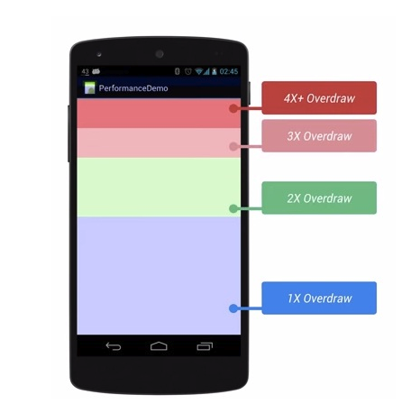
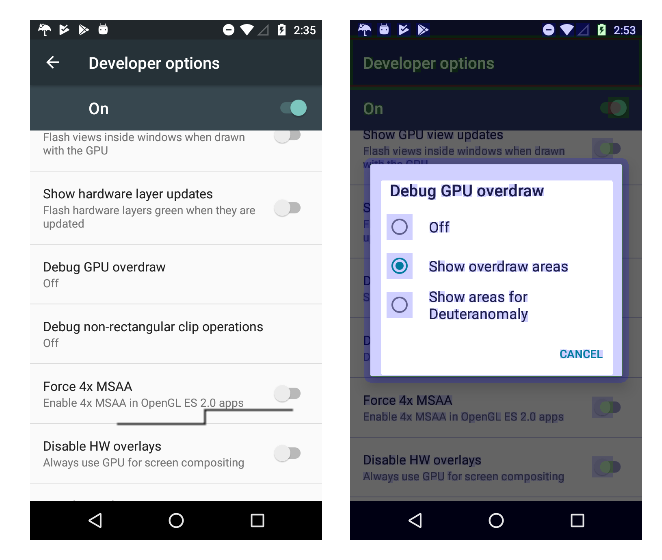
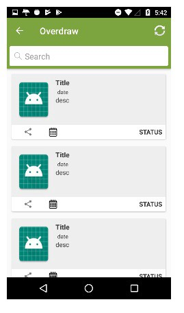
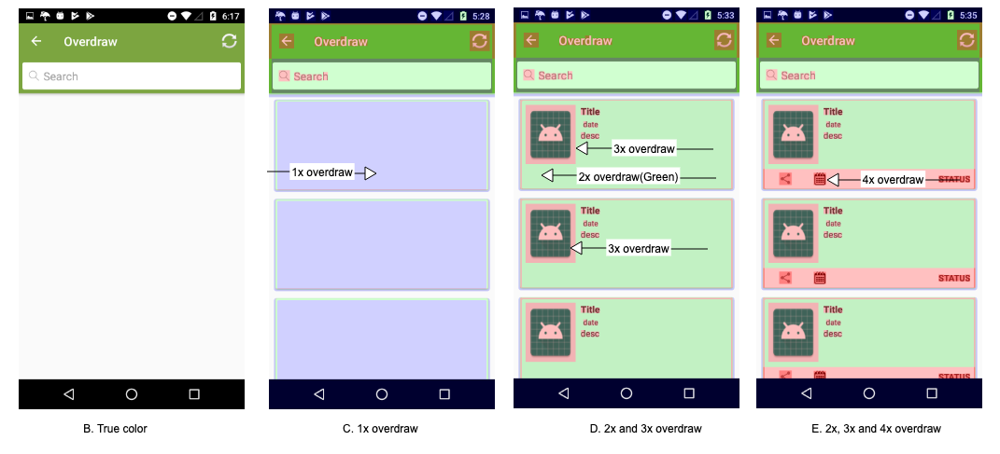

# ANR & Overdraw

## ANR

안드로이드 앱 UI 스레드가 너무 오래 차단되면 트리거되는 오류

### 발생 조건

- 액티비티가 포어그라운드에 있을 때 발생한 이벤트와 BroadcastReceiver에 5초 이내에 응답하지 않았을 경우

- 어떤 액티비티가 포어그라운드에 있지 않을 때, BroadcastReceiver가 상당한 시간 동안 실행을 끝내지 못했을 경우 

### ANR 발생 패턴

- 앱이 입출력과 같은 시간이 필요한 작업을 메인 스레드에서 하고 있을 경우

- 앱이 메인 스레드에서 긴 계산을 수행할 경우

- 메인 스레드에서 다른 프로세스를 통한 동기 바인더 호출을 실행하고 반환 값을 오랫동안 받지 못할 경우

- 다른 스레드의 작업이 진행되는 동안 블록 대기가 발생해 메인 스레드가 차단될 경우

- 메인 스레드가 긴 작업이 완료될 때까지 대기하지 않고 Deadlock 상태에 있을 때
  
  - Deadlock : 두 개 이상의 작업이 서로의 작업이 끝나기를 기다리다가 모든 작업이 교착되는 상태를 가리킨다. 앱을 예로 들면, 한 스레드에서 필요한 리소스를 다른 스레드가 보유하고 있고, 다른 스레드 역시 첫 번째 스레드가 보유한 리소스를 필요로 해서 두 스레드가 서로를 기다리고 있는 상황이다. 다중 프로그래밍 환경에서 흔히 발생할 수 있는 문제로, 교착 상태 방지 알고리즘을 통해 방지해야 한다.

### 진단 방법

- StrictMode
  이 모드로 앱을 실행하면 기본 스레드에서 발생하는 I/O 작업을 찾을 수 있음

- 백그라운드 ANR 다이얼로그 사용 설정하기
  이 옵션은 기본 스레드가 상당한 시간 동안 멈춰 있어야 작동하므로, 낮은 수준의 UI 성능 저하는 감지하지 못할 수 있다.

- Traceview
  앱의 트레이스를 가져와 기본 스레드를 사용하고 있는 위치를 식별할 수 있다.

- Trace 파일 참고하기
  안드로이드는 ANR 발생 시 트레이스 정보를 저장한다. 최신 OS일 경우 /data/anr/anr_* 경로에서 확인할 수 있다. 

- Firebase Crashlytics 활용(앱 사용자의 ANR 원인 파악)

### 문제 해결

- 메인 스레드에서 5초 이상 지연을 일으키는 코드 제거
  Worker 스레드에서 처리하거나 비동기 처리한다.

- 기본 스레드에서 I/O 피하기
  모든 I/O 작업은 Worker 스레드 또는 Coroutine을 이용한다.

## Overdraw

렉이나 자연스럽지 못한, 버벅거리는 UI는 앱의 완성도를 떨어뜨리고 사용자들이 떠나게 만든다. 그래서 UI 스레드에 과부하가 일어나지 않도록 하는 것이 중요한데, 그 과부하를 일으키는 것 중 하나가 Overdraw다.
GPU(Graphics Processing Unit)는 스크린에 뷰를 그릴 때 많은 자원을 사용한다. Overdraw는 말 그대로 덧그리는 것을 의미하는데, 어쩔 수 없는 Overdraw가 아닌 이상 최대한 줄여야한다. Overdraw는 GPU 낭비를 불러오고 이것이 UX에 악영향을 주기 때문이다.

Overdraw의 정도를 나타내기 위해 1x, 2x, 3x Overdraw라는 표현법을 사용한다.

Overdraw가 발생하려면 ViewGroup이 중첩되어 있어야 하는데, ViewGroup 중첩이 항상 Overdraw를 발생시키는 것은 아니다.

ViewGroup은 중첩되어도 상관없지만, 이때 UI 요소를 그릴 때 사용되는 픽셀이 겹치면 Overdraw인 것이다.

Pixel 어떤 UI를 그리기 위해 한번 사용되면 True color라고 부른다. 그 위에 여러번 픽셀이 더해지면, 1x Overdraw, 2x Overdraw 순으로 Overdraw가 더해지는 것이다.

안드로이드에서는 개발자들이 Overdraw를 직관적으로 볼 수 있도록 Overdraw Tool를 제공하고 있다.

### 사용 예시

해당 기능을 사용하려면(안드로이드 12 기준) 
**설정 -> 개발자 옵션 -> GPU 오버드로 디버그 -> 오버드로 영역 표시**를 허용해야한다.

어렵고 복잡한 리팩토링이 이루어지지 않았다. 조금만 생각하면 해결이 가능한, 사소하고 단순한 디테일의 영역이다.

## ConstraintLayout의 장점

1. ViewGroup의 중첩을 피할 수 있다.

2. UI 코드 작성의 시간을 단축할 수 있다.

3. Editor를 통한 UI작업을 통해 XML 코드보다 직관적이고 쉬운 작업이 가능하다.

-> 가능하다면 Android Jetpack이 제공하는 ConstraintLayout을 활용하자

## Reference

[What is ANR and How it Can be Prevented in Android? - GeeksforGeeks](https://www.geeksforgeeks.org/what-is-anr-and-how-it-can-be-prevented-in-android/)

https://developer.android.com/topic/performance/vitals/anr

https://medium.com/wenable/overdraw-in-android-b3ecaaa620b5
