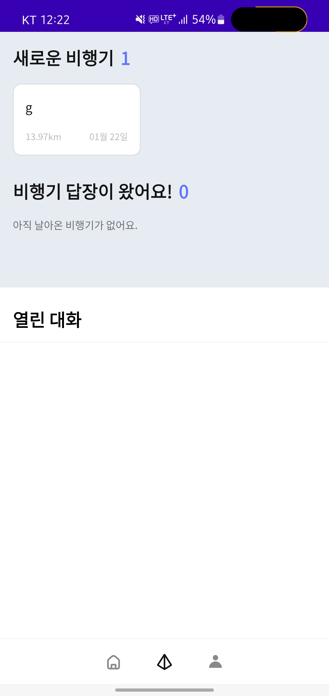

# RecyclerView

- Android JetPack의 구성요소로 동적 목록을 제공하는 데 사용되는 라이브러리이다.

- 리사이클러뷰는 한정된 화면이 스크롤 되어 새로운 항목을 제공해야할 때, 화면 밖으로 보내져 보이지 않는 뷰를 제거하지 않고, 새롭게 나오는 항목의 뷰로 재활용한다.

- 뷰를 매번 지우고 새로 만들지 않기 때문에 메모리 사용량을 줄여 많은 양의 데이터를 표시하도록 도와준다.

## 주요 클래스

- RecyclerView
  데이터에 해당하는 뷰가 포함된 ViewGroup으로, 다른 UI 컴포넌트를 추가하듯 레이아웃에 RecyclerView를 추가하여 사용한다.

- RecyclerView.ViewHolder
  목록의 각 컨텐츠는 뷰 홀더 객체로 정의된다. 뷰 홀더 하나하나가 데이터를 받아서 보여주게 되는데, 뷰 홀더를 생성하고 데이터에 바인딩해줘야 한다. RecyclerView.ViewHolder를 확장하여 바인딩 코드를 작성한다.

- RecyclerView.Adapter
  리사이클러뷰가 뷰를 요청하면 어댑터에서 데이터를 뷰 홀더에 바인딩한다.

- LayoutManager
  목록의 개별 요소를 정렬한다. 라이브러리에서 제공하는 것을 사용하거나 직접 정의하여 정렬 방식을 정의해줄 수도 있다. LayoutManager 추상클래스를 기반으로 한다.

## 구현 과정

### 1. 리사이클러뷰의 리스트, 그리드 모양 결정

 보통 LayoutManager가 제공하는 3가지 manager 중 하나를 사용한다.

- LinearLayoutManager : 1차원 리스트 정렬

- GridLayoutManager : 2x2 그리드 정렬

- StaggeredGridLayoutManager : GridLayoutManager와 비슷하지만 행의 항목이 동일한 높이이거나 너비일 필요 없이 정렬


```kotlin
val firstPlaneAdapter = FirstPaperPlaneAdapter(listOf(), ViewModel) { FirstPaperPlanes ->

            val dialog = FirstDialogFragment.newInstance(
                FirstPaperPlanes
            )
            val fm = childFragmentManager
            dialog.show(fm, "first paper")
        } 

rv_paperplane_first.adapter = firstPlaneAdapter 
val mLayoutManagerFirst = LinearLayoutManager(requireActivity())

mLayoutManagerFirst.reverseLayout = true
        mLayoutManagerFirst.stackFromEnd = true
        mLayoutManagerFirst.orientation = HORIZONTAL

rv_paperplane_first.layoutManager = mLayoutManagerFirst

ViewModel.allFirstPaperPlanes(UID).observe(viewLifecycleOwner, {
            firstPlaneAdapter.differ.submitList(it)
            rv_paperplane_first.scrollToPosition(firstPlaneAdapter.itemCount-1)
            tv_count_first.text = it.size.toString()
            if(it.isNotEmpty()) {
                tv_notice_first_paper.visibility = View.GONE
            } else {
                tv_notice_first_paper.visibility = View.VISIBLE
            }
        })
```

### 2. 아이템 레이아웃 구현

리스트의 항목, 즉 개별 아이템이 들어가게 될 레이아웃을 결정해준다.

```xml
<androidx.constraintlayout.widget.ConstraintLayout xmlns:android="http://schemas.android.com/apk/res/android"
    xmlns:app="http://schemas.android.com/apk/res-auto"
    android:layout_width="wrap_content"
    android:layout_height="wrap_content">

    <androidx.constraintlayout.widget.ConstraintLayout
        android:layout_width="160dp"
        android:layout_height="90dp"
        android:layout_marginEnd="8dp"
        android:background="@drawable/bg_paper"
        android:foreground="?android:attr/selectableItemBackground"
        app:layout_constraintBottom_toBottomOf="parent"
        app:layout_constraintEnd_toEndOf="parent"
        app:layout_constraintStart_toStartOf="parent"
        app:layout_constraintTop_toTopOf="parent">


        <TextView
            android:id="@+id/tv_paperplane_message"
            android:layout_width="match_parent"
            android:layout_height="wrap_content"
            android:layout_marginBottom="16dp"
            android:ellipsize="end"
            android:fontFamily="@font/noto_sans_cjk_kr_regular"
            android:includeFontPadding="false"
            android:letterSpacing="-0.03"
            android:lineSpacingExtra="3dp"
            android:maxLines="1"
            android:textColor="@color/black"
            android:textSize="14sp" 
            android:text="text example"
            app:layout_constraintBottom_toTopOf="@id/tv_paperplane_distance"
            app:layout_constraintEnd_toEndOf="parent"
            app:layout_constraintStart_toStartOf="parent"
            app:layout_constraintTop_toTopOf="parent" />

        <TextView
            android:id="@+id/tv_paperplane_distance"
            android:layout_width="wrap_content"
            android:layout_height="wrap_content"
            android:fontFamily="@font/noto_sans_cjk_kr_regular"
            android:includeFontPadding="false"
            android:text="distance"
            android:textColor="@color/paperplane_rest"
            android:textSize="10sp"
            app:layout_constraintBottom_toBottomOf="parent"
            app:layout_constraintStart_toStartOf="parent" />


        <TextView
            android:id="@+id/tv_paperplane_time"
            android:layout_width="wrap_content"
            android:layout_height="wrap_content"
            android:fontFamily="@font/noto_sans_cjk_kr_regular"
            android:includeFontPadding="false"
            android:text="time"
            android:textColor="@color/paperplane_rest"
            android:textSize="10sp"
            app:layout_constraintBottom_toBottomOf="parent"
            app:layout_constraintEnd_toEndOf="parent" />


    </androidx.constraintlayout.widget.ConstraintLayout>


</androidx.constraintlayout.widget.ConstraintLayout>raintlayout.widget.ConstraintLayout>
```

 {: width="400" height="400"}

### 3. 어댑터 및 뷰 홀더 구현

- Adapter와 ViewHolder가 데이터 표시 방식을 결정한다. 

- **ViewHolder**는 View의 Wrapper로써 리스트의 아이템의 레이아웃을 포함한다.

- **Adapter**는 필요에 따라 ViewHolder 객체를 만들고 뷰의 데이터를 설정해준다. 

- 뷰를 데이터에 연결해주는 것을 **바인딩**이라고 한다.

```kotlin
class FirstPaperPlaneAdapter(
    var list: List<FirstPaperPlanes>,
    val viewModel: FragmentChatViewModel,
    val itemClick: (FirstPaperPlanes) -> Unit
) : RecyclerView.Adapter<FirstPaperPlaneAdapter.FirstPaperPlaneViewHolder>() {

// ViewHolder를 새로 만들 때마다 이 메서드를 호출한다. ViewHolder와 그것을 포함한 View를 생성하고 초기화하지만 각각 아이템의 컨텐츠를 채우지는 않는다.
// 즉, 아직 바인딩이 되지 않은 상태이다.
    override fun onCreateViewHolder(
        parent: ViewGroup,
        viewType: Int
    ): FirstPaperPlaneViewHolder {
        val view =
            LayoutInflater.from(parent.context).inflate(R.layout.column_paperplane, parent, false)

        return FirstPaperPlaneViewHolder(view, itemClick)
    } 

// ViewHolder와 데이터를 연결할 때 호출한다.Holder 내 각각의 위젯에 데이터를 바인딩하는데 여기서는 하단의 ViewHolder inner class를 이용한다.
// 홀더에 들어갈 데이터를 바인딩 전에 따로 작성해준 메서드를 통해 가공한다.
// differ를 통해 현재의 리스트를 받는다.
    override fun onBindViewHolder(
        holder: FirstPaperPlaneViewHolder,
        position: Int
    ) {
        val currentPosition = differ.currentList[position]
        holder.itemView.setOnClickListener { itemClick(currentPosition) }
        holder.bind(currentPosition)
    }

// 데이터 세트의 크기를 가져온다.
    override fun getItemCount(): Int {
        return differ.currentList.size
    }

    inner class FirstPaperPlaneViewHolder(itemView: View, itemClick: (FirstPaperPlanes) -> Unit) :
        RecyclerView.ViewHolder(itemView) {
        fun bind(plane: FirstPaperPlanes?) {
            //check for null
            plane?.let {
                itemView.tv_paperplane_message.text = it.message
                itemView.tv_paperplane_distance.text = convertDistanceToString(it.flightDistance)
                itemView.tv_paperplane_time.text = setDateToTextView(it.timestamp)
            }
        }
    }

    private val differCallback = object : DiffUtil.ItemCallback<FirstPaperPlanes>() {
        override fun areItemsTheSame(
            oldItem: FirstPaperPlanes,
            newItem: FirstPaperPlanes
        ): Boolean {
            return oldItem.fromId == newItem.fromId
        }

        override fun areContentsTheSame(
            oldItem: FirstPaperPlanes,
            newItem: FirstPaperPlanes
        ): Boolean {
            return oldItem == newItem
        }
    }

    val differ = AsyncListDiffer(this, differCallback)

    private fun convertDistanceToString(distance: Double): String {
        return if (distance >= 1000) {
            (round((distance / 1000) * 100) / 100).toString() + "km"
        } else distance.toString() + "m"
    }

    private fun setDateToTextView(timestamp: Long): String {
        var sdf: SimpleDateFormat
        val date = Date(timestamp * 1000)
        val messageTime = Calendar.getInstance()
        messageTime.time = date

        val now = Calendar.getInstance()
        sdf = if (now.get(Calendar.DATE) == messageTime.get(Calendar.DATE)) {
            SimpleDateFormat("a hh:mm")
        } else if (now.get(Calendar.DATE) - messageTime.get(Calendar.DATE) == 1) {
            return "어제"
        } else if (now.get(Calendar.YEAR) == messageTime.get(Calendar.YEAR)) {
            SimpleDateFormat("MM월 dd일")
        } else {
            SimpleDateFormat("yyyy.MM.dd")
        }

        sdf.timeZone = TimeZone.getTimeZone("Asia/Seoul")

        return sdf.format(timestamp * 1000L)
    }
}
```

## References

[RecyclerView로 동적 목록 만들기 - Android Developers](https://developer.android.com/guide/topics/ui/layout/recyclerview)


